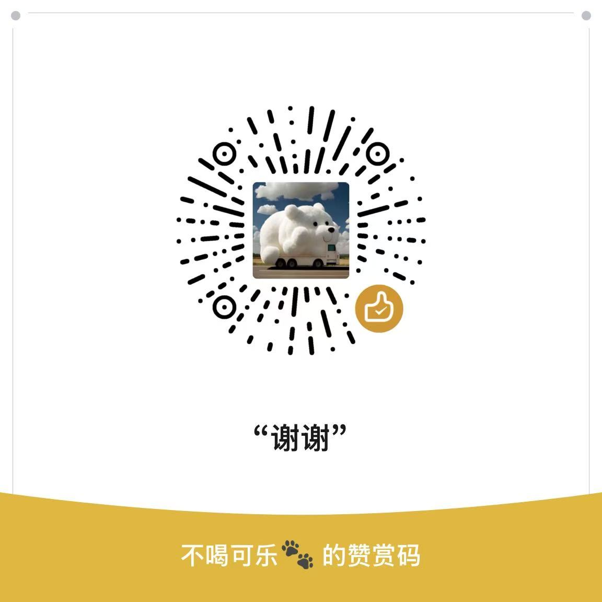

# CsponServer

**CsponServer** 是一个基于 [Drogon](https://github.com/drogonframework/drogon) 的 RESTful API 服务，用于通过 [GDAL](https://gdal.org/) 解析 GDB 文件，获取其矢量图层信息，并计划扩展为支持 GDB 文件的质量检测。

项目支持跨平台运行（Windows 和 Linux），采用 `CMake` 和 [vcpkg](https://github.com/microsoft/vcpkg) 管理依赖，便于快速配置和构建。

---

## 功能特性

### 当前功能
1. **解析 GDB 文件**
   - 使用 GDAL 打开矢量数据库文件（GDB），提取以下信息：
     - 图层名称
     - 几何类型（点、线、面等）
     - 别名（Alias）
     - 图层中的要素数量
     - 空间参考信息（如 Authority Code）

2. **嵌套分组支持**
   - 自动递归解析 GDB 文件中的分组和图层结构，生成层级化的 JSON 响应。

3. **RESTful API 接口**
   - 提供简单易用的 HTTP 接口，客户端可通过 POST 请求获取所需的图层信息。

### 未来功能
- **GDB 文件质量检测**
  - 增加对 GDB 文件的质检功能，如字段完整性检查、几何错误校验等。

---

## 技术栈

- **[Drogon](https://github.com/drogonframework/drogon)**：高性能 C++ Web 框架，用于实现 RESTful API。
- **[GDAL](https://gdal.org/)**：处理地理空间数据的强大工具，支持矢量和栅格数据。
- **C++17/20**：采用现代 C++ 标准编写，性能高效。
- **JSONCPP**：用于解析和生成 JSON 格式的数据。
- **CMake + vcpkg**：用于跨平台构建和依赖管理。

---

## 安装和运行

### 依赖安装

1. 确保你的环境中已安装以下工具：
   - [CMake](https://cmake.org/)（推荐版本 >= 3.20）
   - [vcpkg](https://github.com/microsoft/vcpkg)

2. 使用 `vcpkg` 安装项目依赖：
   ```bash
   vcpkg install drogon gdal jsoncpp


## 请我喝杯咖啡 ☕

如果您觉得本项目对您有帮助，可以请我喝杯咖啡哦~ 😊




感谢您的支持！

